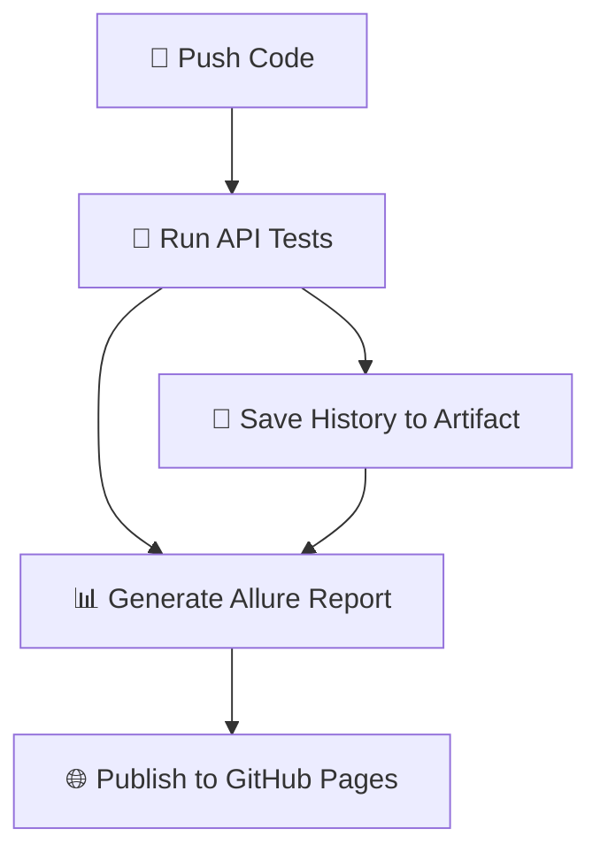

# 📦 Restful-booker API Tests

[](https://github.com/marinagrieg/AcademITSAutoPython/actions)
[](https://marinagrieg.github.io/AcademITSAutoPython/)

API-тесты для [Restful-booker](https://restful-booker.herokuapp.com) — домашнее задание №7 по теме CI/CD (папка `6. Restful booker`).

## Технологии

- Python 3.14
- pytest
- requests
- pydantic
- Allure Report (allure-pytest)
- GitHub Actions
- GitHub Pages

## Запуск тестов из консоли

```bash
pip install -r requirements.txt
pytest "6. Restful booker" -v --alluredir=allure-results
```

## ⚙️ CI/CD Pipeline Overview

